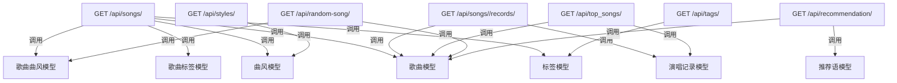
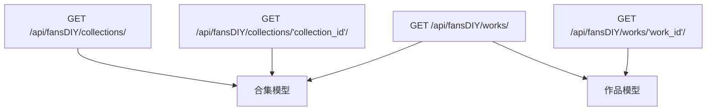
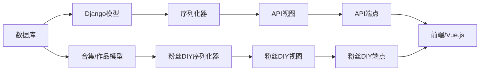

# XXM Fans Home 项目 - 函数关系图

## 概述
该图展示了XXM Fans Home项目中Django模型关键函数之间的关系及其与API端点的交互。

## 核心模型及其关系

```mermaid
erDiagram
    Songs ||--o{ SongRecord : "拥有"
    Songs ||--o{ SongStyle : "分类依据"
    Songs ||--o{ SongTag : "标签标记"
    Style ||--o{ SongStyle : "应用于"
    Tag ||--o{ SongTag : "应用于"
    Songs }|--|| Recommendation : "推荐"
    
    Collection ||--o{ Work : "包含"
    
    Songs {
        int id PK
        string song_name
        string singer
        date last_performed
        int perform_count
        string language
    }
    
    SongRecord {
        int id PK
        int song_id FK
        date performed_at
        string url
        text notes
        string cover_url
    }
    
    Style {
        int id PK
        string name
    }
    
    Tag {
        int id PK
        string name
    }
    
    SongStyle {
        int id PK
        int song_id FK
        int style_id FK
    }
    
    SongTag {
        int id PK
        int song_id FK
        int tag_id FK
    }
    
    Recommendation {
        int id PK
        text content
        boolean is_active
        datetime created_at
        datetime updated_at
    }
    
    Collection {
        int id PK
        string name
        int works_count
        int position
        int display_order
        datetime created_at
        datetime updated_at
    }
    
    Work {
        int id PK
        int collection_id FK
        string title
        string cover_url
        string view_url
        string author
        text notes
        int position
        int display_order
    }
```

## API端点与模型交互

### 音乐管理API



### 粉丝DIY API



## 详细函数关系

### 1. 歌曲模型函数

- `get_search_result()`: 返回格式化的搜索结果字符串
- `styles` 属性: 通过SongStyle关系检索曲风名称列表
- `tags` 属性: 通过SongTag关系检索标签名称列表

### 2. 演唱记录模型函数

- 通过外键关系与歌曲关联
- 存储每首歌曲的演唱详情

### 3. 曲风和标签模型

- 存储分类信息的简单模型
- 通过连接表(SongStyle, SongTag)与歌曲连接

### 4. 连接模型(SongStyle, SongTag)

- 歌曲与曲风/标签之间的多对多关系
- 通过unique_together约束强制唯一组合

### 5. 推荐语模型

- 存储推荐内容
- 通过多对多关系链接到歌曲

### 6. 合集和作品模型(粉丝DIY)

- 合集包含多个作品
- 作品属于一个合集
- 合集中自动管理作品计数

## API端点函数

### 主应用API

1. **GET /api/songs/**
   - 返回分页的歌曲列表
   - 支持按歌曲名和歌手搜索
   - 支持按语言、曲风和标签筛选
   - 返回每首歌曲的相关曲风和标签

2. **GET /api/songs/<song_id>/records/**
   - 返回特定歌曲的分页演唱记录列表
   - 根据演唱日期生成默认封面URL

3. **GET /api/styles/**
   - 返回所有曲风名称列表

4. **GET /api/tags/**
   - 返回所有标签名称列表

5. **GET /api/top_songs/**
   - 返回基于演唱次数排名的歌曲列表
   - 支持不同时段范围(全部、1个月、3个月、1年等)

6. **GET /api/random-song/**
   - 返回随机选择的歌曲及其曲风

7. **GET /api/recommendation/**
   - 返回激活的推荐语及相关歌曲

### 粉丝DIY API

1. **GET /api/fansDIY/collections/**
   - 返回分页的合集列表

2. **GET /api/fansDIY/collections/<collection_id>/**
   - 返回特定合集的详情

3. **GET /api/fansDIY/works/**
   - 返回分页的作品列表
   - 支持按合集筛选

4. **GET /api/fansDIY/works/<work_id>/**
   - 返回特定作品的详情

## 数据流图



## 关键关系总结

1. **歌曲** 是连接到以下模型的中心模型:
   - 演唱记录(演唱历史)
   - 歌曲曲风(分类)
   - 歌曲标签(标记)
   - 推荐语(特色内容)

2. **曲风** 和 **标签** 通过连接表提供分类

3. **合集** 和 **作品** 模型提供粉丝DIY功能

4. **API端点** 将这些关系暴露给前端:
   - 搜索和筛选带有相关曲风和标签的歌曲
   - 查看特定歌曲的演唱历史
   - 通过曲风和标签浏览分类内容
   - 通过推荐语和排行榜发现内容
   - 探索粉丝DIY合集和作品

这种架构允许灵活查询和呈现音乐数据，同时保持不同类型内容之间的关注点清晰分离。