# XXM Fans Home 项目架构图

```mermaid
graph TD
    %% 前端层
    subgraph Frontend["前端 (Vue.js 3 + Element Plus)"]
        subgraph Views["视图"]
            SongListView[SongList.vue]
            TopChartView[TopChart.vue]
            FootprintView[Footprint.vue]
            RecordListView[RecordList.vue]
        end
        
        subgraph Components["组件"]
            SongSearch[SongSearch.vue]
            CollectionGallery[CollectionGallery.vue]
            AdvancedBlindBox[AdvancedBlindBox.vue]
            LuckyWheel[LuckyWheel.vue]
            RandomSongDialog[RandomSongDialog.vue]
        end
        
        subgraph Routing["路由"]
            VueRouter[Vue Router]
        end
    end

    %% API层
    subgraph API["API层 (Django REST Framework)"]
        subgraph MainAPI["主应用API"]
            SongAPI["歌曲API\n/api/songs/"]
            SongRecordAPI["演唱记录API\n/api/songs/{id}/records/"]
            StyleAPI["曲风API\n/api/styles/"]
            TagAPI["标签API\n/api/tags/"]
            TopSongsAPI["热门歌曲API\n/api/top_songs/"]
            RandomSongAPI["随机歌曲API\n/api/random-song/"]
            RecommendationAPI["推荐语API\n/api/recommendation/"]
        end
        
        subgraph FansDIYAPI["粉丝DIY应用API"]
            CollectionAPI["合集API\n/api/fansDIY/collections/"]
            WorkAPI["作品API\n/api/fansDIY/works/"]
        end
    end

    %% 后端层
    subgraph Backend["后端 (Django + Python)"]
        subgraph Django["Django框架"]
            DjangoCore[Django核心]
            DRF[Django REST Framework]
            Admin[Django管理后台]
        end
        
        subgraph Apps["Django应用"]
            MainApp[主应用]
            FansDIYApp[粉丝DIY应用]
        end
        
        subgraph Models["数据模型"]
            SongsModel[歌曲模型]
            SongRecordModel[演唱记录模型]
            StyleModel[曲风模型]
            TagModel[标签模型]
            SongStyleModel[歌曲曲风模型]
            SongTagModel[歌曲标签模型]
            CollectionModel[合集模型]
            WorkModel[作品模型]
            RecommendationModel[推荐语模型]
        end
    end

    %% 数据库层
    subgraph Database["数据库 (SQLite)"]
        SQLite[SQLite数据库]
        SongsTable[歌曲表]
        SongRecordTable[演唱记录表]
        StyleTable[曲风表]
        TagTable[标签表]
        SongStyleTable[歌曲曲风表]
        SongTagTable[歌曲标签表]
        CollectionTable[合集表]
        WorkTable[作品表]
        RecommendationTable[推荐语表]
    end

    %% 外部服务
    subgraph External["外部服务"]
        Bilibili["Bilibili API\n(用于BV数据)"]
        PerformanceTest["Locust\n(性能测试)"]
    end

    %% 连接关系
    %% 前端到API
    SongListView --> SongAPI
    SongListView --> StyleAPI
    SongListView --> TagAPI
    SongListView --> RandomSongAPI
    TopChartView --> TopSongsAPI
    RecordListView --> SongRecordAPI
    CollectionGallery --> CollectionAPI
    CollectionGallery --> WorkAPI
    AdvancedBlindBox --> RandomSongAPI
    LuckyWheel --> RandomSongAPI
    RandomSongDialog --> RandomSongAPI
    
    %% API到后端
    SongAPI --> MainApp
    SongRecordAPI --> MainApp
    StyleAPI --> MainApp
    TagAPI --> MainApp
    TopSongsAPI --> MainApp
    RandomSongAPI --> MainApp
    RecommendationAPI --> MainApp
    CollectionAPI --> FansDIYApp
    WorkAPI --> FansDIYApp
    
    %% 后端到模型
    MainApp --> SongsModel
    MainApp --> SongRecordModel
    MainApp --> StyleModel
    MainApp --> TagModel
    MainApp --> SongStyleModel
    MainApp --> SongTagModel
    MainApp --> RecommendationModel
    FansDIYApp --> CollectionModel
    FansDIYApp --> WorkModel
    
    %% 模型到数据库
    SongsModel --> SongsTable
    SongRecordModel --> SongRecordTable
    StyleModel --> StyleTable
    TagModel --> TagTable
    SongStyleModel --> SongStyleTable
    SongTagModel --> SongTagTable
    CollectionModel --> CollectionTable
    WorkModel --> WorkTable
    RecommendationModel --> RecommendationTable
    
    %% 数据库表到SQLite
    SongsTable --> SQLite
    SongRecordTable --> SQLite
    StyleTable --> SQLite
    TagTable --> SQLite
    SongStyleTable --> SQLite
    SongTagTable --> SQLite
    CollectionTable --> SQLite
    WorkTable --> SQLite
    RecommendationTable --> SQLite
    
    %% 外部服务
    Bilibili --> SongRecordModel
    PerformanceTest --> API

    %% 样式定义
    classDef frontendStyle fill:#64b5f6,stroke:#333,color:#fff;
    classDef apiStyle fill:#81c784,stroke:#333,color:#fff;
    classDef backendStyle fill:#ffb74d,stroke:#333,color:#fff;
    classDef databaseStyle fill:#ba68c8,stroke:#333,color:#fff;
    classDef externalStyle fill:#ff8a65,stroke:#333,color:#fff;
    
    class Frontend,Views,Components,Routing frontendStyle
    class API,MainAPI,FansDIYAPI apiStyle
    class Backend,Django,Apps,Models backendStyle
    class Database,SQLite databaseStyle
    class External,Bilibili,PerformanceTest externalStyle

```

## 架构组件概述

### 1. 前端层 (Vue.js 3 + Element Plus)
- **视图**: 主要页面如歌曲列表、排行榜、足迹和演唱记录列表
- **组件**: 可复用的UI组件如歌曲搜索、合集画廊、高级盲盒等
- **路由**: Vue Router用于视图间导航

### 2. API层 (Django REST Framework)
- **主应用API**: 歌曲、演唱记录、曲风、标签、排行榜和推荐语的端点
- **粉丝DIY应用API**: 合集和作品(粉丝创作内容)的端点

### 3. 后端层 (Django + Python)
- **Django框架**: 核心Django功能与REST Framework用于API创建
- **应用**: 主应用用于音乐管理，粉丝DIY应用用于粉丝创作内容
- **模型**: 表示歌曲、演唱记录、曲风、标签、合集和作品的数据模型

### 4. 数据库层 (SQLite)
- **表**: 每个模型对应单独的表，并具有适当的关系
- **关系**: 表之间的外键和多对多关系

### 5. 外部服务
- **Bilibili API**: 用于导入BV(哔哩哔哩视频)数据
- **Locust**: 性能测试框架

## 架构中展示的关键功能

1. **音乐管理**: 歌曲、演唱记录、曲风和标签，支持搜索和筛选功能
2. **粉丝内容管理**: 合集和作品用于粉丝创作内容
3. **排行榜系统**: 不同时段范围的热门歌曲展示
4. **盲盒功能**: 随机歌曲选择，支持高级筛选选项
5. **数据可视化**: 图表和统计数据展示
6. **性能测试**: 与Locust集成进行负载测试