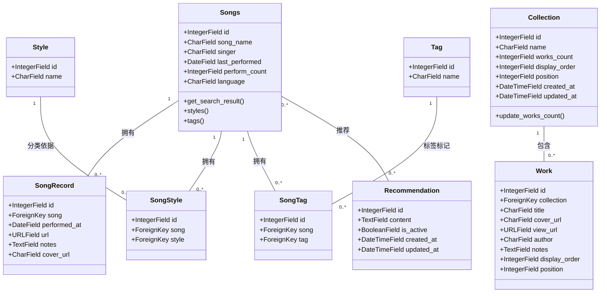

# XXM Fans Home UML类图

## 概述
此UML类图表示XXM Fans Home项目的数据模型结构，重点关注主要的Django模型及其关系。

## 类详情

### Songs (歌曲)
表示音乐集合中的单个歌曲。

**属性:**
- `id` (IntegerField): 主键
- `song_name` (CharField): 歌曲名称 (最大200个字符)
- `singer` (CharField): 歌手 (最大200个字符, 可为空)
- `last_performed` (DateField): 上次演唱日期 (可为空)
- `perform_count` (IntegerField): 演唱次数 (默认: 0)
- `language` (CharField): 歌曲语言 (最大50个字符, 可为空)

**方法:**
- `get_search_result()`: 返回格式化的搜索结果字符串
- `styles()`: 返回与歌曲关联的曲风名称列表
- `tags()`: 返回与歌曲关联的标签名称列表

### SongRecord (演唱记录)
表示歌曲的单个演唱记录。

**属性:**
- `id` (IntegerField): 主键
- `song` (ForeignKey): 指向Songs模型的引用 (related_name: 'records')
- `performed_at` (DateField): 演唱日期
- `url` (URLField): 演唱视频的URL (可为空)
- `notes` (TextField): 关于演唱的附加说明 (可为空)
- `cover_url` (CharField): 封面图片的URL (最大300个字符, 可为空)

### Style (曲风)
表示音乐曲风/流派。

**属性:**
- `id` (IntegerField): 主键
- `name` (CharField): 曲风名称 (最大100个字符, 唯一)

### Tag (标签)
表示可以与歌曲关联的标签。

**属性:**
- `id` (IntegerField): 主键
- `name` (CharField): 标签名称 (最大100个字符, 唯一)

### SongStyle (歌曲曲风)
Songs和Styles之间多对多关系的中间模型。

**属性:**
- `id` (IntegerField): 主键
- `song` (ForeignKey): 指向Songs模型的引用
- `style` (ForeignKey): 指向Style模型的引用

### SongTag (歌曲标签)
Songs和Tags之间多对多关系的中间模型。

**属性:**
- `id` (IntegerField): 主键
- `song` (ForeignKey): 指向Songs模型的引用
- `tag` (ForeignKey): 指向Tag模型的引用

### Recommendation (推荐语)
表示歌曲的推荐文本。

**属性:**
- `id` (IntegerField): 主键
- `content` (TextField): 推荐内容
- `is_active` (BooleanField): 推荐是否激活 (默认: True)
- `created_at` (DateTimeField): 推荐创建时间
- `updated_at` (DateTimeField): 推荐最后更新时间

### Collection (合集)
表示粉丝创作作品的合集。

**属性:**
- `id` (IntegerField): 主键
- `name` (CharField): 合集名称 (最大200个字符)
- `works_count` (IntegerField): 合集中作品数量 (默认: 0)
- `display_order` (IntegerField): 显示顺序 (默认: 0)
- `position` (IntegerField): 位置 (默认: 0)
- `created_at` (DateTimeField): 合集创建时间
- `updated_at` (DateTimeField): 合集最后更新时间

**方法:**
- `update_works_count()`: 根据实际数量更新works_count字段

### Work (作品)
表示单个粉丝创作作品。

**属性:**
- `id` (IntegerField): 主键
- `collection` (ForeignKey): 指向Collection模型的引用 (related_name: 'works')
- `title` (CharField): 作品标题 (最大300个字符)
- `cover_url` (CharField): 封面图片的URL (最大500个字符, 可为空)
- `view_url` (URLField): 查看作品的URL (可为空)
- `author` (CharField): 作品作者 (最大100个字符)
- `notes` (TextField): 关于作品的附加说明 (可为空)
- `display_order` (IntegerField): 显示顺序 (默认: 0)
- `position` (IntegerField): 位置 (默认: 0)

## 关系

1. **Songs → SongRecord**: 一对多关系。每首歌曲可以有多个演唱记录。

2. **Songs → SongStyle → Style**: 通过SongStyle中间模型实现的多对多关系。每首歌曲可以有多种曲风，每种曲风可以与多首歌曲关联。

3. **Songs → SongTag → Tag**: 通过SongTag中间模型实现的多对多关系。每首歌曲可以有多个标签，每个标签可以与多首歌曲关联。

4. **Songs → Recommendation**: 多对多关系。每首歌曲可以有多个推荐语，每个推荐语可以与多首歌曲关联。

5. **Collection → Work**: 一对多关系。每个合集可以包含多个作品。

## 说明
- 所有模型都继承自Django的`models.Model`基类
- 图中显示了每个类最相关的属性和方法
- 关系基数用标准UML符号表示
- 中间模型(SongStyle, SongTag)对于带有附加字段的Django多对多关系是必需的