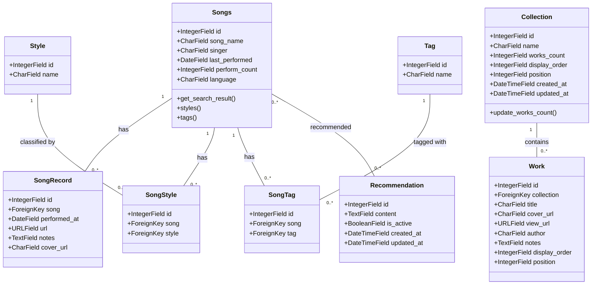

# XXM Fans Home UML Class Diagram

## Overview
This UML class diagram represents the data model structure of the XXM Fans Home project, focusing on the main Django models and their relationships.

## Class Details

### Songs
Represents individual songs in the music collection.

**Attributes:**
- `id` (IntegerField): Primary key
- `song_name` (CharField): Name of the song (max 200 characters)
- `singer` (CharField): Singer of the song (max 200 characters, nullable)
- `last_performed` (DateField): Date when the song was last performed (nullable)
- `perform_count` (IntegerField): Number of times the song has been performed (default: 0)
- `language` (CharField): Language of the song (max 50 characters, nullable)

**Methods:**
- `get_search_result()`: Returns a formatted string for search results
- `styles()`: Returns a list of style names associated with the song
- `tags()`: Returns a list of tag names associated with the song

### SongRecord
Represents individual performance records of songs.

**Attributes:**
- `id` (IntegerField): Primary key
- `song` (ForeignKey): Reference to the Songs model (related_name: 'records')
- `performed_at` (DateField): Date when the song was performed
- `url` (URLField): URL to the performance (nullable)
- `notes` (TextField): Additional notes about the performance (nullable)
- `cover_url` (CharField): URL to the cover image (max 300 characters, nullable)

### Style
Represents musical styles/genres.

**Attributes:**
- `id` (IntegerField): Primary key
- `name` (CharField): Name of the style (max 100 characters, unique)

### Tag
Represents tags that can be associated with songs.

**Attributes:**
- `id` (IntegerField): Primary key
- `name` (CharField): Name of the tag (max 100 characters, unique)

### SongStyle
Intermediate model for the many-to-many relationship between Songs and Styles.

**Attributes:**
- `id` (IntegerField): Primary key
- `song` (ForeignKey): Reference to the Songs model
- `style` (ForeignKey): Reference to the Style model

### SongTag
Intermediate model for the many-to-many relationship between Songs and Tags.

**Attributes:**
- `id` (IntegerField): Primary key
- `song` (ForeignKey): Reference to the Songs model
- `tag` (ForeignKey): Reference to the Tag model

### Recommendation
Represents recommendation texts for songs.

**Attributes:**
- `id` (IntegerField): Primary key
- `content` (TextField): Content of the recommendation
- `is_active` (BooleanField): Whether the recommendation is active (default: True)
- `created_at` (DateTimeField): When the recommendation was created
- `updated_at` (DateTimeField): When the recommendation was last updated

### Collection
Represents collections of fan-created works.

**Attributes:**
- `id` (IntegerField): Primary key
- `name` (CharField): Name of the collection (max 200 characters)
- `works_count` (IntegerField): Number of works in the collection (default: 0)
- `display_order` (IntegerField): Display order (default: 0)
- `position` (IntegerField): Position (default: 0)
- `created_at` (DateTimeField): When the collection was created
- `updated_at` (DateTimeField): When the collection was last updated

**Methods:**
- `update_works_count()`: Updates the works_count field based on actual count

### Work
Represents individual fan-created works.

**Attributes:**
- `id` (IntegerField): Primary key
- `collection` (ForeignKey): Reference to the Collection model (related_name: 'works')
- `title` (CharField): Title of the work (max 300 characters)
- `cover_url` (CharField): URL to the cover image (max 500 characters, nullable)
- `view_url` (URLField): URL to view the work (nullable)
- `author` (CharField): Author of the work (max 100 characters)
- `notes` (TextField): Additional notes about the work (nullable)
- `display_order` (IntegerField): Display order (default: 0)
- `position` (IntegerField): Position (default: 0)

## Relationships

1. **Songs → SongRecord**: One-to-Many relationship. Each song can have multiple performance records.

2. **Songs → SongStyle → Style**: Many-to-Many relationship implemented through the SongStyle intermediate model. Each song can have multiple styles, and each style can be associated with multiple songs.

3. **Songs → SongTag → Tag**: Many-to-Many relationship implemented through the SongTag intermediate model. Each song can have multiple tags, and each tag can be associated with multiple songs.

4. **Songs → Recommendation**: Many-to-Many relationship. Each song can have multiple recommendations, and each recommendation can be associated with multiple songs.

5. **Collection → Work**: One-to-Many relationship. Each collection can contain multiple works.

## Notes
- All models inherit from Django's `models.Model` base class
- The diagram shows the most relevant attributes and methods for each class
- Relationship cardinalities are indicated with standard UML notation
- The intermediate models (SongStyle, SongTag) are necessary for Django's many-to-many relationships with additional fields